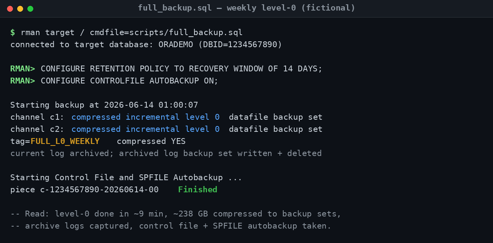
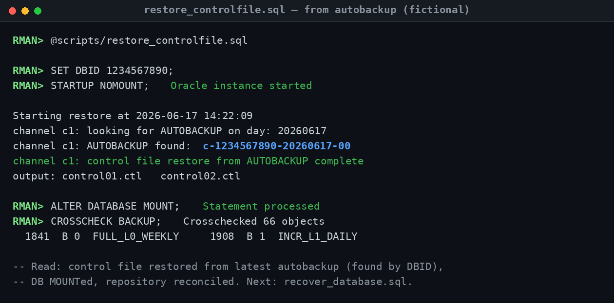
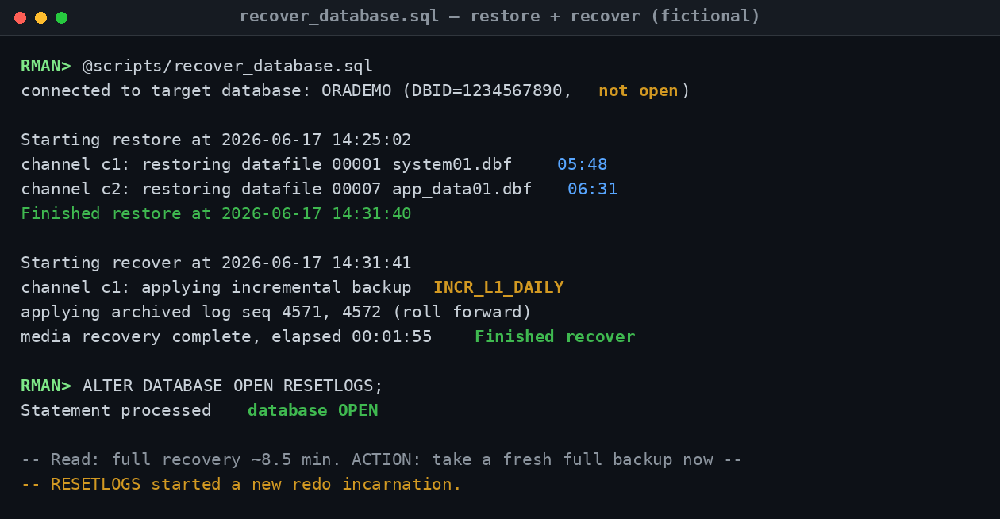
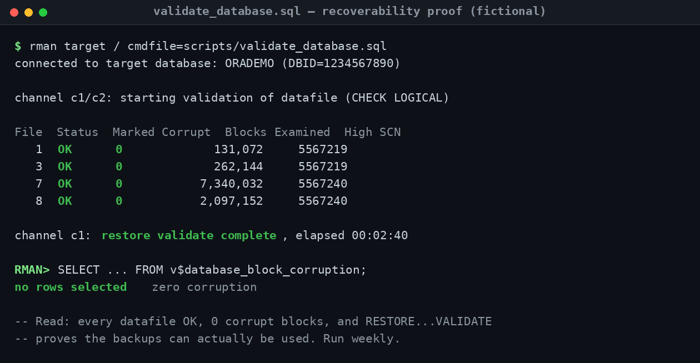
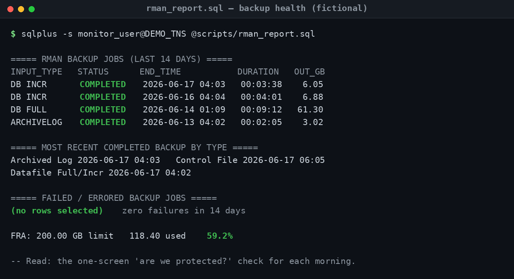

## Operational Screenshots (Proof of Work)

A backup strategy is a claim. A recovery is the proof. This section shows the scripts in this repository actually running against a sanitized demo database (`ORADEMO`, `DBID 1234567890`) — taking the backup, then *using* it: restoring a control file, restoring and recovering the database, validating that the backups are genuinely usable, and reporting that the whole estate is protected. Every value is fictional; there are no real hostnames, DBIDs, paths, or company data.

What separates a senior DBA from a principal one isn't running `BACKUP DATABASE` — it's having *rehearsed the recovery* and being able to prove the backups work before an outage forces the question. These five captures walk the full lifecycle in the order it matters: **back up → restore the control file → restore & recover → prove it's recoverable → monitor that it stays that way.**

---

### 1 · Owning the backup strategy end to end (`full_backup.sql`)

**Problem demonstrated.** The foundation of every recovery: a clean weekly level-0 that the daily incrementals build on. If this base backup is wrong — no autobackup, no archive logs, no retention policy — every recovery downstream is compromised.

**What an experienced DBA concludes.** This is a complete, self-documenting strategy, not just a backup command. The run first *configures* the contract — a 14-day recovery window and control file autobackup `ON` — then takes a compressed level-0 across two channels, captures and clears the archive logs, and finishes with a control file + SPFILE autobackup. The `FULL_L0_WEEKLY` tag means recovery scripts can reference the base backup by name. ~238 GB compressed in ~9 minutes, with parallelism doing the work.

**Troubleshooting takeaway.** Control file autobackup is non-negotiable — it's what makes disaster recovery possible when you've lost the control file *and* the catalog (screenshot 2 depends on it). Always tag backups meaningfully and set the retention policy in the script, so the strategy is reproducible and self-documenting rather than living in one person's head.

---

### 2 · The disaster-recovery starting point (`restore_controlfile.sql`)

**Problem demonstrated.** The worst-case start: the database won't mount because the control file is gone, and there's no recovery catalog to fall back on. This is where a real disaster recovery actually begins — from `NOMOUNT`.

**What an experienced DBA concludes.** This is textbook DR sequencing. With no control file and no catalog, the *DBID* becomes the key: `SET DBID`, `STARTUP NOMOUNT`, then RMAN locates the most recent control file autobackup by that DBID and restores it. The database mounts, `CROSSCHECK` reconciles the repository against what's physically on disk (66 objects), and the level-0 and level-1 backups reappear — ready for the next step. The operator knows the order cold and doesn't improvise.

**Troubleshooting takeaway.** Record your DBID somewhere outside the database — without it you cannot find the autobackup, and recovery stalls at the first step. After restoring the control file, always `CROSSCHECK` before recovering, so RMAN's repository matches reality and won't try to use a backup piece that isn't there.

---

### 3 · Recovery under pressure (`recover_database.sql`)

**Problem demonstrated.** The skill every interview panel probes hardest: restore the datafiles, apply the incrementals and archived redo to roll forward, and bring the database back open. This is the moment the backup strategy is cashed in.

**What an experienced DBA concludes.** The full chain executes cleanly: datafiles restored from the level-0 across parallel channels, the `INCR_L1_DAILY` incremental applied, archived logs (seq 4571–4572) rolled forward, and the database opened with `RESETLOGS` — about 8.5 minutes end to end here. The detail that signals real experience is the closing note: `OPEN RESETLOGS` starts a **new redo incarnation**, so the very next action must be a fresh full backup. A DBA who forgets that has a database that can't be recovered to any point after the reset.

**Troubleshooting takeaway.** Recovery isn't done at `OPEN RESETLOGS` — it's done after you've taken a fresh level-0, because the old backups belong to the previous incarnation. Knowing *what to do the minute after* the database opens is the difference between a recovery and a near-miss.

---

### 4 · Proving backups are recoverable, not just present (`validate_database.sql`)

**Problem demonstrated.** The question that should never be answered for the first time during an outage: *can these backups actually restore?* A backup that completed is not the same as a backup that works.

**What an experienced DBA concludes.** This is verification, not faith. `BACKUP VALIDATE ... CHECK LOGICAL` examines every datafile for physical *and* logical corruption — all `OK`, `0` marked corrupt across millions of blocks — and `RESTORE ... VALIDATE` confirms the existing backup sets could genuinely be used to restore. `v$database_block_corruption` returns no rows. Run weekly, this turns "we have backups" into "we have *proven* we can recover," on a schedule, before anyone has to ask.

**Troubleshooting takeaway.** `VALIDATE` reads backups without touching production, so there's no excuse not to run it regularly. Pair block validation with `RESTORE ... VALIDATE` — the first proves the data is clean, the second proves the backups are usable; you want both green before you ever need them.

---

### 5 · Operational monitoring discipline (`rman_report.sql`)

**Problem demonstrated.** The daily "are we protected?" question, answered on one screen. Backups failing silently is one of the most common ways teams discover — too late — that they're unrecoverable.

**What an experienced DBA concludes.** Everything reconciles: nightly incrementals and the weekly full all `COMPLETED`, the most-recent-by-type rollup shows archive, control file, and datafile backups all current within hours, the failed-jobs section is empty across 14 days, and the FRA sits at a healthy 59%. This is the morning glance that catches a silent failure on day one instead of during a recovery. It also closes the loop with the health-checks repo, where FRA pressure is the early warning for `ORA-00257`.

**Troubleshooting takeaway.** Monitor *most-recent-success by type*, not just "did last night's job run" — a backup can succeed while archive log backups quietly stop, leaving a growing gap. A one-screen daily report that surfaces failures and FRA usage together is the cheapest insurance a DBA owns.

---

> **All screenshots are fully sanitized and fictional.** `ORADEMO`, `DBID 1234567890`, paths like `/u01/app/oracle/...`, tags (`FULL_L0_WEEKLY`, `INCR_L1_DAILY`), and all values are illustrative demo data created for this portfolio — no production, employer, or confidential information is shown. Each capture mirrors the annotated transcript in [`sample_outputs/`](sample_outputs/), where every example ends with a **"Read:"** note explaining what to conclude and do next.
