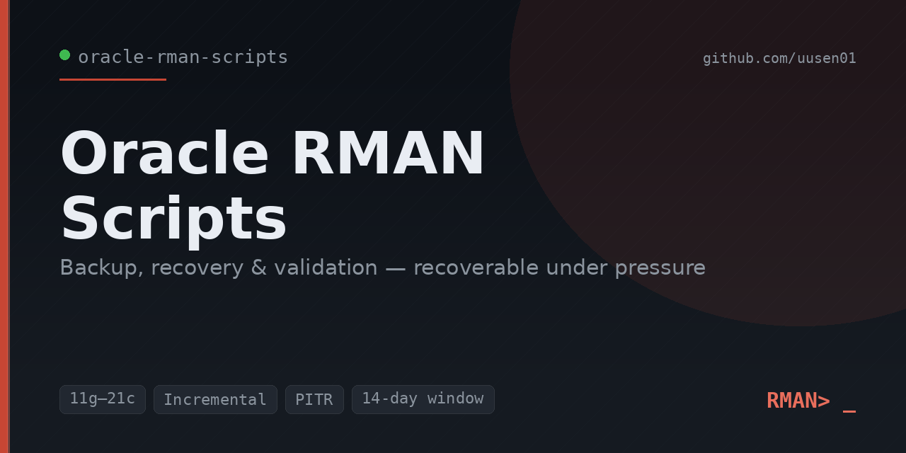

<p align="center">
  
</p>

# Oracle RMAN Scripts

A production-style library of **RMAN backup, recovery, and maintenance scripts** for
Oracle databases — the backup strategy, the recovery playbooks, and the verification
routines a Senior Oracle DBA uses to keep enterprise databases recoverable.

The set covers the full lifecycle: configure and back up (full + incremental + archive
logs + control file/SPFILE), verify and maintain (validate, crosscheck, retention-based
cleanup), and recover (control file restore, database restore/recover, point-in-time,
and database duplication). A SQL\*Plus reporting script gives a one-screen view of
backup health.

---

## Purpose

A backup is only as good as the recovery it enables. This repository packages a
**tested, repeatable RMAN strategy** — weekly level-0 plus daily level-1 incrementals,
frequent archive log backups, a 14-day recovery window, control file/SPFILE protection,
and regular validation — alongside the **recovery procedures** that turn those backups
into a restored database under pressure.

Every script has a full header (purpose, version compatibility, which client to run it
in, an execution example, an explanation, and a sanitization note). The companion docs
turn the scripts into a documented backup procedure, a restore/recovery guide, and a
troubleshooting reference.

---

## Supported versions

| Oracle version | Status |
|---|---|
| Oracle Database **11g** | ✅ Supported (11g-specific duplicate syntax noted inline) |
| Oracle Database **12c** | ✅ Supported |
| Oracle Database **19c** | ✅ Supported |
| Oracle Database **21c** | ✅ Supported |

Scripts use RMAN commands and data-dictionary views stable across these releases, and
work on single-instance and RAC. Where syntax differs by version (e.g.,
`DUPLICATE ... USING BACKUPSET` on 12c+ vs. the 11g form), the alternative is included
as an inline comment.

---

## ⚠️ Disclaimer — sanitized & generic by design

All scripts, sample outputs, and documentation are **fully sanitized and generic**. They
contain **no** real hostnames, IP addresses, SIDs, service names, DBIDs, credentials, or
employer/company data. Every value in `sample_outputs/` is **fictional**, written purely
to show what a run looks like and how to read it. Placeholders such as
`/u01/app/oracle/...`, `ORADEMO`, `DBID 1234567890`, `SRCDB`/`AUXDB`, and tag names must
be set for your environment before use.

These are reference scripts for portfolio and educational use. **Several scripts are
destructive recovery operations** — test every script in a non-production environment and
apply under your own change-control process.

---

## A note on the `.sql` file extension

Most files here are **RMAN command scripts** run inside the RMAN client
(`rman target / cmdfile=full_backup.sql` or `RMAN> @full_backup.sql`) — RMAN accepts a
command file regardless of extension. **`rman_report.sql`** is the exception: it is a
**SQL\*Plus** script that queries the RMAN data-dictionary views. Each script's header
states exactly which client to use.

---

## Script index

| Script | Type | What it does |
|---|---|---|
| [`full_backup.sql`](scripts/full_backup.sql) | RMAN | One-time CONFIGURE + weekly level-0 full backup + archive logs + control file/SPFILE |
| [`archivelog_backup.sql`](scripts/archivelog_backup.sql) | RMAN | Daily level-1 incremental + archive log backup with space reclamation |
| [`controlfile_backup.sql`](scripts/controlfile_backup.sql) | RMAN | On-demand binary + trace control file backup; ensures autobackup on |
| [`spfile_backup.sql`](scripts/spfile_backup.sql) | RMAN | On-demand SPFILE backup + readable PFILE fallback |
| [`validate_database.sql`](scripts/validate_database.sql) | RMAN | Block validation + restore-feasibility check (proves backups are usable) |
| [`crosscheck_backup.sql`](scripts/crosscheck_backup.sql) | RMAN | Reconcile repository with media; clean EXPIRED records |
| [`delete_obsolete.sql`](scripts/delete_obsolete.sql) | RMAN | Report + delete backups outside the retention window |
| [`restore_controlfile.sql`](scripts/restore_controlfile.sql) | RMAN | Restore control file from autobackup (NOMOUNT → MOUNT) |
| [`recover_database.sql`](scripts/recover_database.sql) | RMAN | Restore + recover database (full or point-in-time) → OPEN RESETLOGS |
| [`duplicate_database.sql`](scripts/duplicate_database.sql) | RMAN | Clone a database to a new name/host (active or backup-based) |
| [`rman_report.sql`](scripts/rman_report.sql) | SQL\*Plus | Backup health report: jobs, last-success-by-type, failures, FRA usage |

A sanitized, annotated sample run of every script lives in
[`sample_outputs/`](sample_outputs/).

---

## Usage

**Prerequisites:** an Oracle client with the RMAN and SQL\*Plus executables, OS access to
the database host (or appropriate net-service connections), and an account that can
connect as `SYSDBA`/`SYSBACKUP` for RMAN operations. A read-only monitoring account is
sufficient for `rman_report.sql`.

**Run an RMAN script:**
```
rman target / cmdfile=scripts/full_backup.sql log=/u01/app/oracle/rman_logs/full.log
# or interactively:
rman target /
RMAN> @scripts/full_backup.sql
```

**Run the reporting script (SQL\*Plus):**
```
sqlplus -s monitor_user@DEMO_TNS @scripts/rman_report.sql
```

**Typical schedule** (full detail in [docs/RMAN Backup Procedure.md](docs/RMAN%20Backup%20Procedure.md)):

| When | Script |
|---|---|
| Weekly | `full_backup.sql` |
| Daily | `archivelog_backup.sql`, `crosscheck_backup.sql`, `delete_obsolete.sql` |
| Every 1–4 hrs | `archivelog_backup.sql` (archive section) |
| Weekly | `validate_database.sql` |
| Daily (morning) | `rman_report.sql` |

---

## Sample output

From `rman_report.sql` (fictional data):

```
============= RMAN BACKUP JOBS (LAST 14 DAYS) ===============

INPUT_TYPE       STATUS       START_TIME         END_TIME           DURATION       IN_GB   OUT_GB
---------------- ------------ ------------------ ------------------ ------------ -------- --------
DB INCR          COMPLETED    2026-06-17 04:00   2026-06-17 04:03   00:03:38        24.10     6.05
DB FULL          COMPLETED    2026-06-14 01:00   2026-06-14 01:09   00:09:12       238.00    61.30
```

From `recover_database.sql` (fictional data):

```
Starting recover at 2026-06-17 14:31:41
channel c1: applying incremental backup INCR_L1_DAILY
media recovery complete, elapsed time: 00:01:55
RMAN> ALTER DATABASE OPEN RESETLOGS;
Statement processed
```

Each file in [`sample_outputs/`](sample_outputs/) ends with a short **"Read:"** note
explaining what a DBA should conclude.

---

## Operational Screenshots (Proof of Work)

A backup strategy is a claim. A recovery is the proof. This section shows the scripts in this repository actually running against a sanitized demo database (`ORADEMO`, `DBID 1234567890`) — taking the backup, then *using* it: restoring a control file, restoring and recovering the database, validating that the backups are genuinely usable, and reporting that the whole estate is protected. Every value is fictional; there are no real hostnames, DBIDs, paths, or company data.

What separates a senior DBA from a principal one isn't running `BACKUP DATABASE` — it's having *rehearsed the recovery* and being able to prove the backups work before an outage forces the question. These five captures walk the full lifecycle in the order it matters: **back up → restore the control file → restore & recover → prove it's recoverable → monitor that it stays that way.**

---

### 1 · Owning the backup strategy end to end (`full_backup.sql`)


**Problem demonstrated.** The foundation of every recovery: a clean weekly level-0 that the daily incrementals build on. If this base backup is wrong — no autobackup, no archive logs, no retention policy — every recovery downstream is compromised.

**What an experienced DBA concludes.** This is a complete, self-documenting strategy, not just a backup command. The run first *configures* the contract — a 14-day recovery window and control file autobackup `ON` — then takes a compressed level-0 across two channels, captures and clears the archive logs, and finishes with a control file + SPFILE autobackup. The `FULL_L0_WEEKLY` tag means recovery scripts can reference the base backup by name. ~238 GB compressed in ~9 minutes, with parallelism doing the work.

**Troubleshooting takeaway.** Control file autobackup is non-negotiable — it's what makes disaster recovery possible when you've lost the control file *and* the catalog (screenshot 2 depends on it). Always tag backups meaningfully and set the retention policy in the script, so the strategy is reproducible and self-documenting rather than living in one person's head.

---

### 2 · The disaster-recovery starting point (`restore_controlfile.sql`)


**Problem demonstrated.** The worst-case start: the database won't mount because the control file is gone, and there's no recovery catalog to fall back on. This is where a real disaster recovery actually begins — from `NOMOUNT`.

**What an experienced DBA concludes.** This is textbook DR sequencing. With no control file and no catalog, the *DBID* becomes the key: `SET DBID`, `STARTUP NOMOUNT`, then RMAN locates the most recent control file autobackup by that DBID and restores it. The database mounts, `CROSSCHECK` reconciles the repository against what's physically on disk (66 objects), and the level-0 and level-1 backups reappear — ready for the next step. The operator knows the order cold and doesn't improvise.

**Troubleshooting takeaway.** Record your DBID somewhere outside the database — without it you cannot find the autobackup, and recovery stalls at the first step. After restoring the control file, always `CROSSCHECK` before recovering, so RMAN's repository matches reality and won't try to use a backup piece that isn't there.

---

### 3 · Recovery under pressure (`recover_database.sql`)


**Problem demonstrated.** The skill every interview panel probes hardest: restore the datafiles, apply the incrementals and archived redo to roll forward, and bring the database back open. This is the moment the backup strategy is cashed in.

**What an experienced DBA concludes.** The full chain executes cleanly: datafiles restored from the level-0 across parallel channels, the `INCR_L1_DAILY` incremental applied, archived logs (seq 4571–4572) rolled forward, and the database opened with `RESETLOGS` — about 8.5 minutes end to end here. The detail that signals real experience is the closing note: `OPEN RESETLOGS` starts a **new redo incarnation**, so the very next action must be a fresh full backup. A DBA who forgets that has a database that can't be recovered to any point after the reset.

**Troubleshooting takeaway.** Recovery isn't done at `OPEN RESETLOGS` — it's done after you've taken a fresh level-0, because the old backups belong to the previous incarnation. Knowing *what to do the minute after* the database opens is the difference between a recovery and a near-miss.

---

### 4 · Proving backups are recoverable, not just present (`validate_database.sql`)


**Problem demonstrated.** The question that should never be answered for the first time during an outage: *can these backups actually restore?* A backup that completed is not the same as a backup that works.

**What an experienced DBA concludes.** This is verification, not faith. `BACKUP VALIDATE ... CHECK LOGICAL` examines every datafile for physical *and* logical corruption — all `OK`, `0` marked corrupt across millions of blocks — and `RESTORE ... VALIDATE` confirms the existing backup sets could genuinely be used to restore. `v$database_block_corruption` returns no rows. Run weekly, this turns "we have backups" into "we have *proven* we can recover," on a schedule, before anyone has to ask.

**Troubleshooting takeaway.** `VALIDATE` reads backups without touching production, so there's no excuse not to run it regularly. Pair block validation with `RESTORE ... VALIDATE` — the first proves the data is clean, the second proves the backups are usable; you want both green before you ever need them.

---

### 5 · Operational monitoring discipline (`rman_report.sql`)


**Problem demonstrated.** The daily "are we protected?" question, answered on one screen. Backups failing silently is one of the most common ways teams discover — too late — that they're unrecoverable.

**What an experienced DBA concludes.** Everything reconciles: nightly incrementals and the weekly full all `COMPLETED`, the most-recent-by-type rollup shows archive, control file, and datafile backups all current within hours, the failed-jobs section is empty across 14 days, and the FRA sits at a healthy 59%. This is the morning glance that catches a silent failure on day one instead of during a recovery. It also closes the loop with the health-checks repo, where FRA pressure is the early warning for `ORA-00257`.

**Troubleshooting takeaway.** Monitor *most-recent-success by type*, not just "did last night's job run" — a backup can succeed while archive log backups quietly stop, leaving a growing gap. A one-screen daily report that surfaces failures and FRA usage together is the cheapest insurance a DBA owns.

---

> **All screenshots are fully sanitized and fictional.** `ORADEMO`, `DBID 1234567890`, paths like `/u01/app/oracle/...`, tags (`FULL_L0_WEEKLY`, `INCR_L1_DAILY`), and all values are illustrative demo data created for this portfolio — no production, employer, or confidential information is shown. Each capture mirrors the annotated transcript in [`sample_outputs/`](sample_outputs/), where every example ends with a **"Read:"** note explaining what to conclude and do next.

---

## Documentation

| Doc | Contents |
|---|---|
| [RMAN Backup Procedure](docs/RMAN%20Backup%20Procedure.md) | Strategy, retention model, daily/weekly schedule, scheduling, do's & don'ts |
| [Restore and Recovery Guide](docs/Restore%20and%20Recovery%20Guide.md) | Six recovery scenarios mapped to the exact scripts, plus restore drills |
| [RMAN Troubleshooting Guide](docs/RMAN%20Troubleshooting%20Guide.md) | The eight most common RMAN errors — cause and fix for each |

---

## Repository structure

```
oracle-rman-scripts/
├── README.md
├── LICENSE
├── .gitignore
├── scripts/             # 11 RMAN command scripts + 1 SQL*Plus report
├── sample_outputs/      # fictional, sanitized example output for each script
├── docs/                # backup procedure, restore/recovery, troubleshooting
└── screenshots/         # sanitized RMAN session captures — see "Operational Screenshots"
```

---

## Future enhancements

- **`run_all` orchestration** — shell/PowerShell wrappers with failure alerting, plus
  cron / Task Scheduler examples for the weekly/daily/hourly cadence.
- **Block change tracking setup script** — to make level-1 incrementals even faster.
- **SBT / cloud object-storage examples** — backing up to tape and to OCI/AWS S3.
- **Recovery catalog setup** — `CREATE CATALOG` / `REGISTER DATABASE` for repository
  resilience across many databases.
- **Data Guard-aware backups** — offloading backups to a physical standby.
- **`RECOVER TABLE` example** (12c+) — single-table point-in-time recovery without a
  full PITR.

---

## License

Released under the [MIT License](LICENSE) — free to use, adapt, and share with
attribution.
